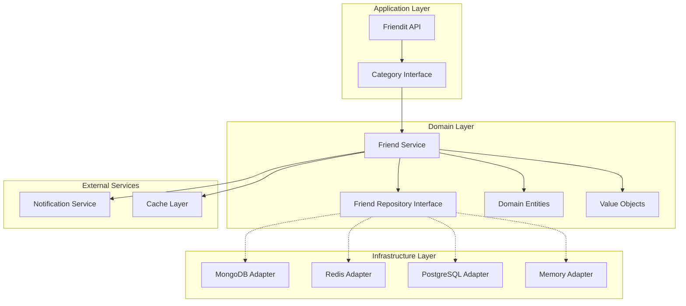
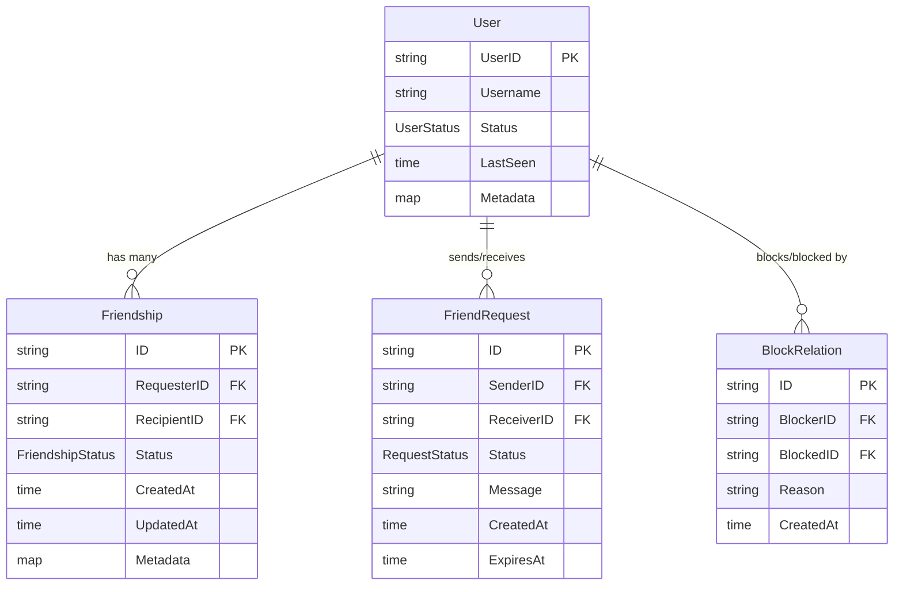
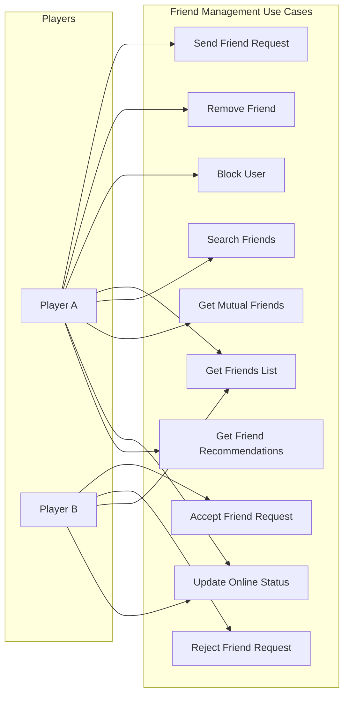

# Friendit - 친구 관리 서비스

## 서비스 개요

Friendit은 게임 서버를 위한 친구 관리 서비스입니다. 도메인 로직과 인프라를 분리하여 다양한 저장소(MongoDB, Redis, PostgreSQL 등)에서 동작할 수 있도록 설계되었습니다.

## 핵심 기능 (Use Cases)

### 1. 친구 관계 관리
- 친구 요청 보내기/받기
- 친구 요청 수락/거절
- 친구 삭제
- 차단/차단 해제

### 2. 친구 목록 조회
- 온라인/오프라인 친구 목록
- 친구 상태 실시간 업데이트
- 친구 검색 및 필터링
- 공통 친구 찾기

### 3. 친구 활동 추적
- 최근 접속 시간
- 게임 내 활동 상태
- 친구 추천 시스템
- 친구 관계 통계

## 아키텍처 다이어그램



## 도메인 모델



## 사용 사례 다이어그램



## 서비스 인터페이스

### Core Service Interface
```go
type FriendService interface {
    // Friend Request Management
    SendFriendRequest(ctx context.Context, senderID, receiverID string, message string) (*FriendRequest, error)
    AcceptFriendRequest(ctx context.Context, requestID string) error
    RejectFriendRequest(ctx context.Context, requestID string) error
    
    // Friendship Management  
    RemoveFriend(ctx context.Context, userID, friendID string) error
    BlockUser(ctx context.Context, blockerID, blockedID string, reason string) error
    UnblockUser(ctx context.Context, blockerID, blockedID string) error
    
    // Friend Discovery
    GetFriends(ctx context.Context, userID string, filters ...FriendFilter) ([]*Friend, error)
    SearchFriends(ctx context.Context, userID string, query string) ([]*Friend, error)
    GetMutualFriends(ctx context.Context, userID1, userID2 string) ([]*Friend, error)
    GetFriendRecommendations(ctx context.Context, userID string, limit int) ([]*User, error)
    
    // Status Management
    UpdateUserStatus(ctx context.Context, userID string, status UserStatus) error
    GetOnlineFriends(ctx context.Context, userID string) ([]*Friend, error)
}
```

### Repository Interfaces
```go
type FriendRepository interface {
    CreateFriendship(ctx context.Context, friendship *Friendship) error
    GetFriendship(ctx context.Context, userID1, userID2 string) (*Friendship, error)
    UpdateFriendship(ctx context.Context, friendship *Friendship) error
    DeleteFriendship(ctx context.Context, userID1, userID2 string) error
    ListFriendships(ctx context.Context, userID string, filters ...Filter) ([]*Friendship, error)
}

type UserRepository interface {
    GetUser(ctx context.Context, userID string) (*User, error)
    UpdateUserStatus(ctx context.Context, userID string, status UserStatus) error
    SearchUsers(ctx context.Context, query string, limit int) ([]*User, error)
}

type FriendRequestRepository interface {
    CreateRequest(ctx context.Context, request *FriendRequest) error
    GetRequest(ctx context.Context, requestID string) (*FriendRequest, error)
    UpdateRequestStatus(ctx context.Context, requestID string, status RequestStatus) error
    ListPendingRequests(ctx context.Context, userID string) ([]*FriendRequest, error)
}
```

## 사용자 중심 커스터마이징 API

### Builder Pattern으로 최대한 유연한 설정

```go
// Category-based API with full customization
var Friendit = &FrienditCategory{}

type FrienditCategory struct {
    service FriendService
}

// Fluent API로 다양한 커스터마이징 지원
func (f *FrienditCategory) Request() *FriendRequestBuilder
func (f *FrienditCategory) Filter() *FriendFilterBuilder  
func (f *FrienditCategory) Config() *FriendConfigBuilder
func (f *FrienditCategory) Policy() *FriendPolicyBuilder
func (f *FrienditCategory) Event() *FriendEventBuilder
```

### 1. 친구 요청 커스터마이징

```go
// 기본 사용법
dukdakit.Friendit.Request().
    From("user123").
    To("user456").
    WithMessage("Let's play together!").
    Send()

// 고급 커스터마이징
dukdakit.Friendit.Request().
    From("user123").
    To("user456").
    WithMessage("Let's play together!").
    WithMetadata(map[string]interface{}{
        "game_mode": "pvp",
        "skill_level": "pro",
        "language": "ko",
    }).
    WithExpiry(dukdakit.Timex.Option().Hours(48)).  // 48시간 후 만료
    WithPriority(FriendRequestPriority.High).        // 우선순위 설정
    WithAutoAccept(func(req *FriendRequest) bool {   // 자동 수락 조건
        return req.Metadata["skill_level"] == "pro"
    }).
    OnSuccess(func(friendship *Friendship) {         // 성공 콜백
        log.Printf("New friendship created: %s", friendship.ID)
    }).
    OnFailure(func(err error) {                      // 실패 콜백
        log.Printf("Friend request failed: %v", err)
    }).
    Send()
```

### 2. 친구 조회 및 필터링 커스터마이징

```go
// 기본 친구 목록
friends := dukdakit.Friendit.Filter().
    User("user123").
    Online().
    Get()

// 고급 필터링 및 정렬
friends := dukdakit.Friendit.Filter().
    User("user123").
    Status(UserStatus.Online, UserStatus.Away).      // 다중 상태
    Game("wow", "lol").                               // 특정 게임 플레이어
    LastActive(dukdakit.Timex.Option().Hours(24)).    // 24시간 내 활동
    SkillLevel("pro", "expert").                      // 스킬 레벨
    Language("ko", "en").                             // 언어 설정
    Mutual("user789").                                // 공통 친구
    SortBy(FriendSort.LastActive.Desc()).             // 최근 활동 순
    Limit(50).
    Offset(dukdakit.Pagit.Cursor("cursor_token")).    // 페이지네이션
    WithMetadata().                                   // 메타데이터 포함
    Get()

// 커스텀 필터 함수
friends := dukdakit.Friendit.Filter().
    User("user123").
    Custom(func(friend *Friend) bool {
        // 커스텀 비즈니스 로직
        return friend.Metadata["guild_id"] == "guild123" &&
               friend.Stats.WinRate > 0.7
    }).
    Get()
```

### 3. 정책 및 규칙 커스터마이징

```go
// 친구 관리 정책 설정
dukdakit.Friendit.Policy().
    MaxFriends(500).                                  // 최대 친구 수
    MaxPendingRequests(50).                           // 최대 대기 중인 요청
    RequestCooldown(dukdakit.Timex.Option().Minutes(5)). // 요청 간 쿨다운
    AutoReject(func(req *FriendRequest) bool {        // 자동 거절 조건
        return req.Sender.ReputationScore < 0.3
    }).
    BlockDuration(dukdakit.Timex.Option().Days(7)).   // 차단 기본 기간
    AllowUnblock(true).                               // 차단 해제 허용
    RequireMessage(true).                             // 친구 요청 시 메시지 필수
    Apply()
```

### 4. 이벤트 및 훅 시스템

```go
// 이벤트 리스너 등록
dukdakit.Friendit.Event().
    OnFriendRequest(func(event *FriendRequestEvent) {
        // 커스텀 알림 로직
        notificationService.Send(event.ReceiverID, 
            "New friend request from " + event.SenderName)
    }).
    OnFriendAdded(func(event *FriendshipEvent) {
        // 친구 추가 시 게임 내 보상 지급
        rewardService.GrantFriendBonus(event.UserID, event.FriendID)
    }).
    OnFriendOnline(func(event *UserStatusEvent) {
        // 친구 온라인 시 실시간 알림
        realtime.Broadcast(event.UserID, "friend_online", event.Friend)
    }).
    OnFriendBlocked(func(event *BlockEvent) {
        // 차단 시 게임 내 매치메이킹에서 제외
        matchmaking.ExcludeUser(event.BlockerID, event.BlockedID)
    }).
    Register()

// 조건부 이벤트 처리
dukdakit.Friendit.Event().
    OnFriendAdded().
    Where(func(event *FriendshipEvent) bool {
        return event.Friendship.Metadata["source"] == "guild_invite"
    }).
    Do(func(event *FriendshipEvent) {
        guildService.GrantInviteReward(event.UserID)
    }).
    Register()
```

### 5. 설정 및 구성 커스터마이징

```go
// 서비스 전역 설정
dukdakit.Friendit.Config().
    Storage(mongoAdapter).                            // 저장소 어댑터
    Cache(redisCache).                               // 캐시 레이어
    RateLimit(100, dukdakit.Timex.Option().Minutes(1)). // 속도 제한
    Encryption(encryptionKey).                       // 데이터 암호화
    Timeout(dukdakit.Timex.Option().Seconds(30)).     // 요청 타임아웃
    RetryPolicy(retryPolicyBuilder.MaxAttempts(3)).  // 재시도 정책
    Metrics(prometheusCollector).                    // 메트릭 수집
    Logger(customLogger).                            // 커스텀 로깅
    Apply()

// 사용자별 개인 설정
dukdakit.Friendit.Config().
    User("user123").
    Privacy(PrivacyLevel.FriendsOnly).               // 개인정보 보호 수준
    SearchableBy(SearchScope.Friends).                // 검색 가능 범위
    AutoAcceptFrom("guild_members").                  // 자동 수락 그룹
    NotificationSettings(map[string]bool{             // 알림 설정
        "friend_request": true,
        "friend_online": false,
        "friend_playing": true,
    }).
    CustomFields(map[string]interface{}{              // 커스텀 프로필 필드
        "favorite_games": []string{"wow", "lol"},
        "playing_hours": "19:00-23:00",
        "skill_rating": 1850,
    }).
    Apply()
```

### 6. 확장 가능한 플러그인 시스템

```go
// 커스텀 플러그인 등록
type CustomFriendRecommendation struct{}

func (c *CustomFriendRecommendation) Recommend(userID string, limit int) ([]*User, error) {
    // ML 기반 친구 추천 로직
    return mlService.GetRecommendations(userID, limit)
}

// 플러그인 등록
dukdakit.Friendit.Plugin().
    Recommendation(new(CustomFriendRecommendation)).
    Validator(new(CustomFriendValidator)).
    NotificationHandler(new(CustomNotificationHandler)).
    Register()

// 미들웨어 체인
dukdakit.Friendit.Middleware().
    Use(authenticationMiddleware).
    Use(rateLimitingMiddleware). 
    Use(auditLogMiddleware).
    Use(metricsMiddleware).
    Apply()
```

### 7. 테스트 및 디버깅 지원

```go
// 테스트 모드
dukdakit.Friendit.Test().
    MockStorage().                                   // 인메모리 저장소
    SimulateUser("test_user").                       // 테스트 사용자 생성
    FastForward(dukdakit.Timex.Option().Days(1)).    // 시간 시뮬레이션
    EnableDebugLogs().                               // 디버그 로깅
    RecordEvents().                                  // 이벤트 기록
    Start()

// 성능 프로파일링
profile := dukdakit.Friendit.Profile().
    TrackMemory().
    TrackCPU().
    TrackLatency().
    GenerateReport()
```

## 성능 고려사항

### 확장성 전략
- **수평 확장**: 사용자별 샤딩 지원
- **캐싱**: 온라인 상태, 친구 목록 Redis 캐시
- **읽기 최적화**: 친구 목록 읽기 전용 복제본 활용
- **비동기 처리**: 친구 추천, 알림 발송 큐잉

### 데이터 구조 최적화
- **인덱싱**: UserID 기반 복합 인덱스
- **배치 처리**: 대량 친구 상태 업데이트
- **페이지네이션**: Pagit 활용한 친구 목록 조회
- **TTL**: 만료된 친구 요청 자동 정리

## 보안 고려사항

### 개인정보 보호
- 차단된 사용자 간 정보 차단
- 친구 목록 공개 설정 지원
- 검색 가능 여부 설정

### 남용 방지
- 친구 요청 스팸 방지 (시간당 제한)
- 대량 친구 추가 방지
- 반복적인 차단/해제 방지

## 모니터링 및 메트릭

```go
// Service Metrics
type FrienditMetrics struct {
    FriendRequestsSent     counter
    FriendRequestsAccepted counter
    ActiveFriendships      gauge
    OnlineUsers           gauge
    ResponseTime          histogram
}
```

## 구현 순서

1. **Phase 1**: 도메인 엔터티 및 핵심 비즈니스 로직
2. **Phase 2**: Repository 인터페이스 및 MongoDB 어댑터
3. **Phase 3**: DukDakit 카테고리 API 구현
4. **Phase 4**: Redis 캐시 레이어 및 성능 최적화
5. **Phase 5**: 친구 추천 알고리즘 및 고급 기능